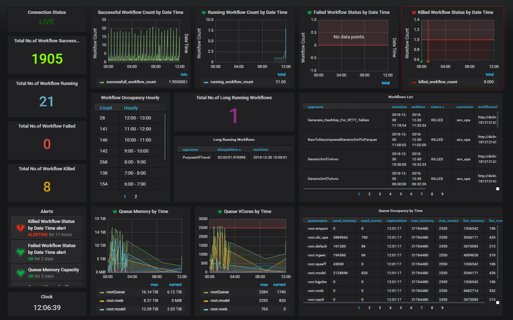
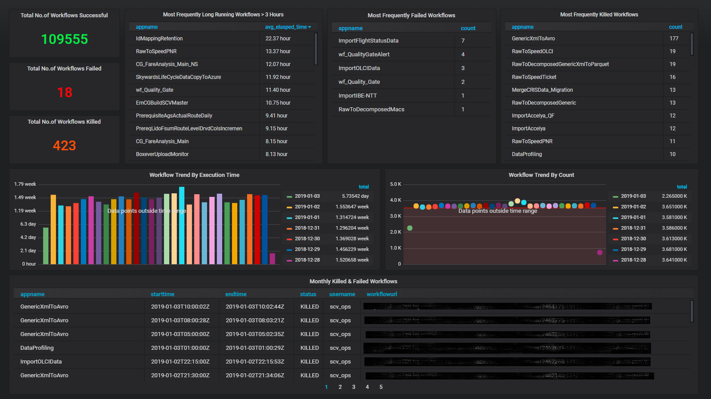
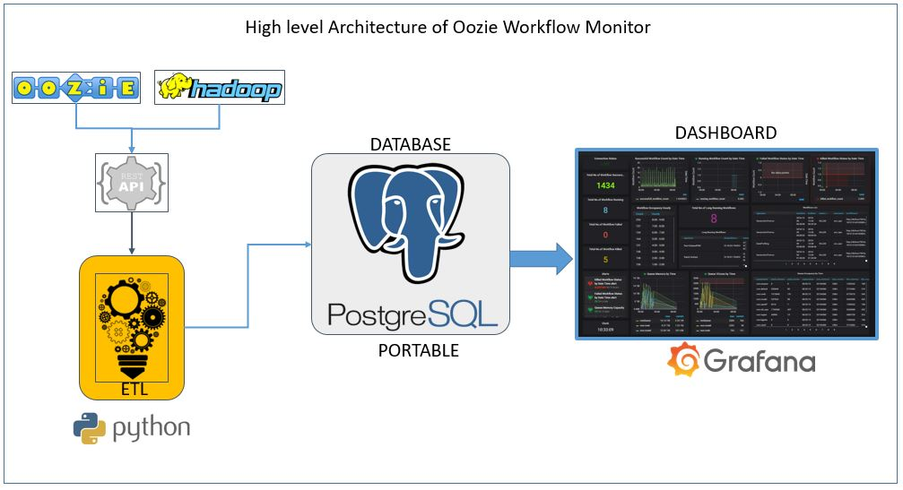

# 1. Introduction
# 2. Architecture
# 3. Installation & Usage
# 4. References

# oozie_workflow_monitor
Oozie Workflow Monitor is a simple,insightful &amp; agent less live dashboard for monitoring the Oozie workflows. It is packed with eye catching widgets to monitor the workflow performance, success rate, failure rate and long running workflows that helps to make some quick decisions to tune the workflows and cluster. With web-based dashboard we can easily and seamlessly view the dashboard anywhere and share the results across the teams
# Live Dashbaord 

# Monthy Trend

# High Level Architecture

